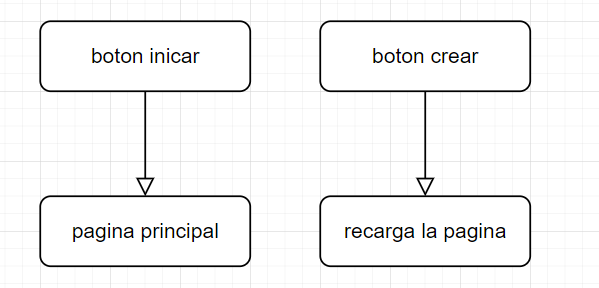
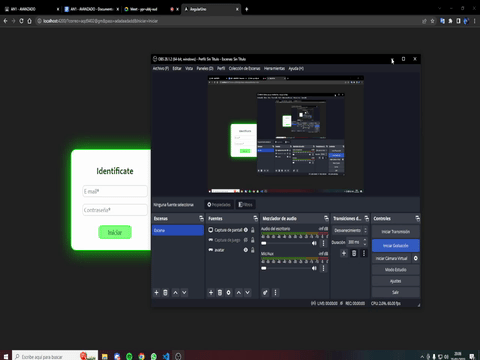
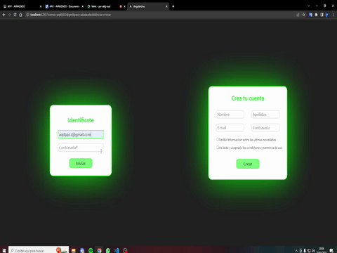
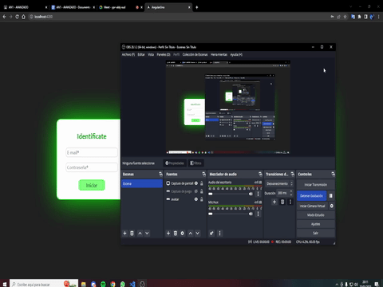
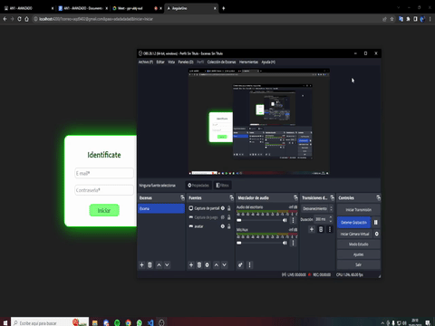

# JS2

## 1. ANALISIS DEL PROBLEMA   
1. Seguir los pasos de instalación del vídeo suministrado “Instalación Angular.mp4”.
2. Crear los componentes que se indican en la siguiente imagen con la ayuda del vídeo “Componentes Angular.mp4”:
3. Añadir las verificaciones de cada input-botón mostrando un error en caso de que no se cumplan:

a)Email: Debe ser un email con su @ y otras validaciones. Buscar en internet. No debe estar vacío.

b)Password: No deben mostrarse los caracteres, sólo los puntos. No debe estar vacío.

c)Last Name: Puede estar vacío. Es un input normal.

d)First Name: No puede estar vacío. Es un input normal.

e)Botón con texto: Puede estar habilitado o deshabilitado.

f)Hiperenlace: Mostrará diferentes textos.

4. Añadir un componente que se pueda utilizar para el proyecto individual.
5. Realizar un boceto de cada una de las pantallas que se vayan a utilizar en el proyecto individual con la finalidad de reutilizar este trabajo y así reducir el esfuerzo total.

## 2.DISEÑO

## 3.IMPLEMENTACION
Implemento todo lo visto anteriormente para realizar el problema

## 4.PRUEBAS

## Prueba 1 Email: Debe ser un email con su @ y otras validaciones. Buscar en internet. No debe estar vacío.

## Prueba 2 Password: No deben mostrarse los caracteres, sólo los puntos. No debe estar vacío.

## Prueba 3 Last Name: Puede estar vacío. Es un input normal.

## Prueba 4 First Name: No puede estar vacío. Es un input normal.

