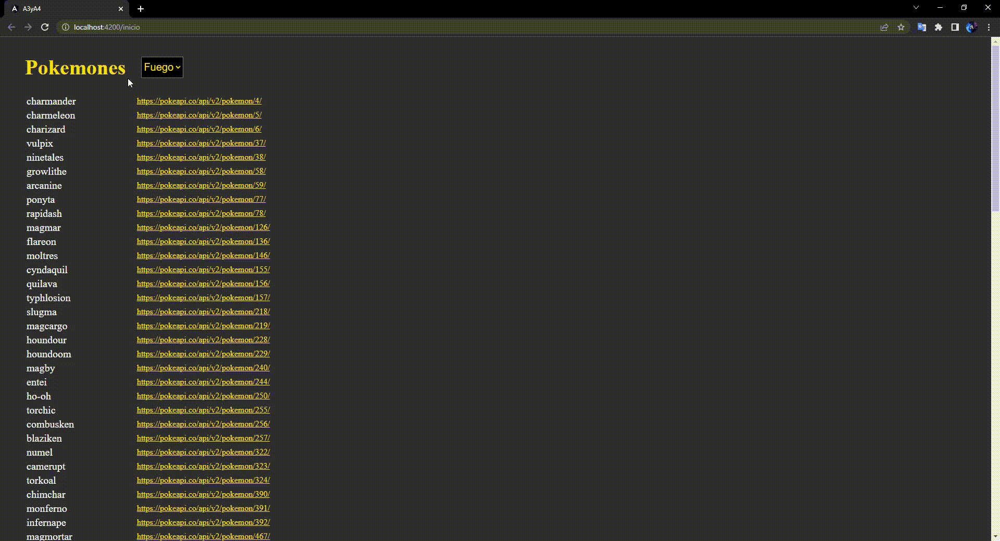

# ngStyle, ngClass y ngTemplate :sunglasses: 

#### ngStyle:

La directiva ngStyle toma un objeto JavaScript que define un conjunto de estilos CSS y los aplica al elemento que tiene la directiva ngStyle. El objeto JavaScript debe tener las propiedades CSS como nombres de propiedades y los valores de esas propiedades como valores de la propiedad.

Ejemplo: 

`<h1 [ngStyle]="{'background-color':'#fff'}">Not found</h1>`

#### ngClass:

La directiva ngClass toma un objeto JavaScript, una cadena de texto o una matriz de valores y los aplica al elemento que tiene la directiva ngClass.
La ventaja de usar ngClass es que se pueden aplicar clases de manera dinámica en función de las condiciones o valores de una variable o expresión Angular. Esto permite que los estilos se ajusten automáticamente en función del estado de la aplicación o de los datos que se están procesando.

Ejemplo:

##### app.component.css
div {
  width: 200px;
  height: 100px;
  text-align: center;
  border: 1px solid #ccc;
  background-color: #f0f0f0;
  padding: 20px;
}

.active {
  background-color: #3CB371;
  color: white;
}

##### app.component.html
`<button (click)="isActive = !isActive">Activar/Desactivar</button>`
`

Este es un ejemplo de ngClass

`

#### ngTemplate:
ngTemplate es una directiva de Angular que se utiliza para definir una plantilla reutilizable que se puede usar en diferentes partes de una aplicación. Las plantillas son fragmentos de código HTML que se pueden rellenar con datos dinámicamente y se pueden mostrar en la página.

La ventaja de usar ngTemplate es que se pueden definir plantillas que se ajusten a diferentes necesidades y se puedan utilizar en múltiples lugares sin tener que escribir el mismo código HTML varias veces. También se pueden utilizar para crear componentes personalizados que encapsulan una funcionalidad y un estilo específicos.

Ejemplo ngTemplate con ngFor:

`<ng-template #miPlantilla let-items>`
  `<ul>`
   ` <li *ngFor="let item of items">{{item}}</li>`
  `</ul>`
`</ng-template>`

## Prueba de correcto funcionamiento:

