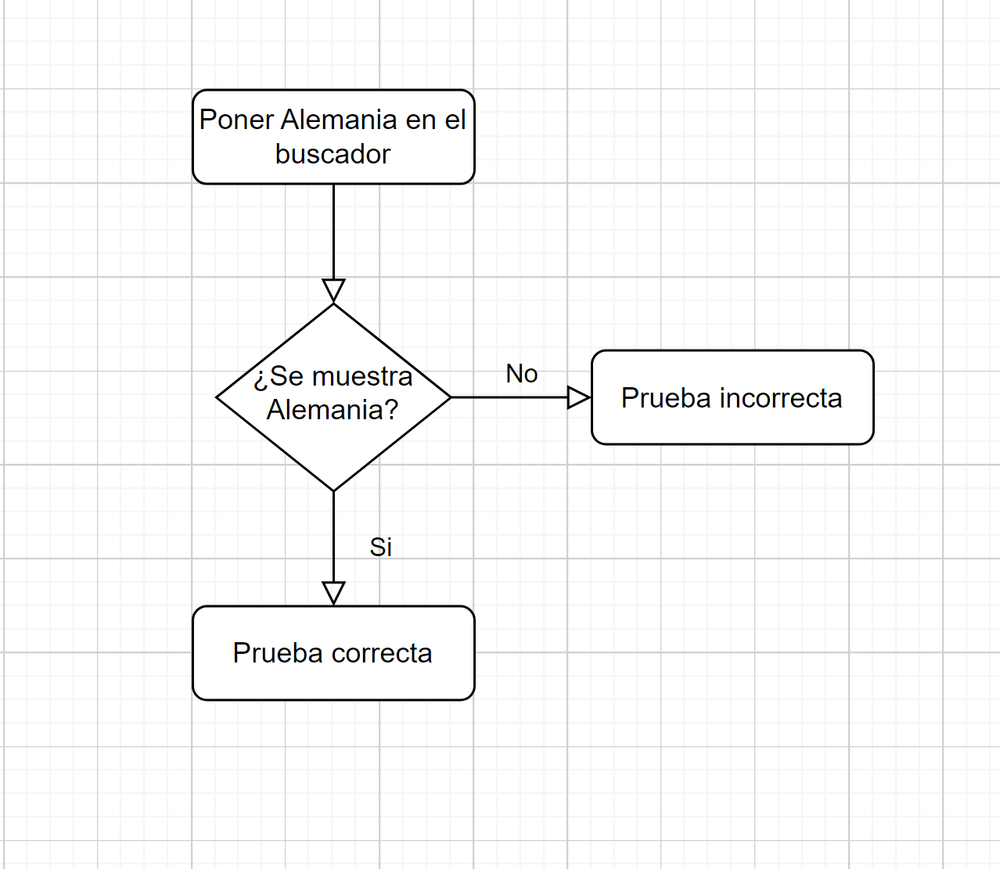
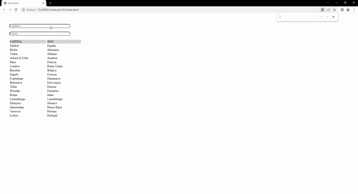
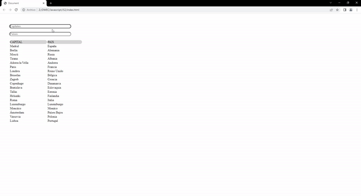
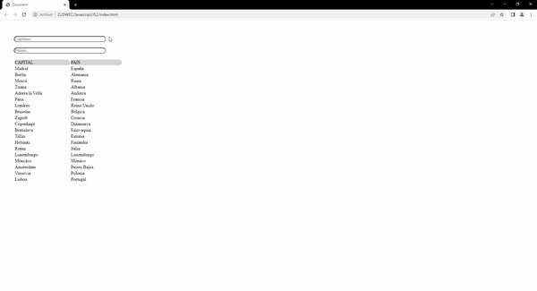

# JS2

## 1. ANALISIS DEL PROBLEMA   
1. Generación de json de capitales y países.
2. Modificación y visualización de los cambios en la web.
3. Filtrado de datos.
4.Añadir a la historia de usuario un segundo filtro destinado a filtrar por países además de añadir la descripción de la historia de usuario teniendo como referencia el arriba indicado.

## 2.DISEÑO

## 3.IMPLEMENTACION
Implemento todo lo visto anteriormente para realizar el problema

## 4.PRUEBAS

### Criterio 1

Dado que tenemos una tabla con las capitales y países,
Cuando introducimos en el buscador “Berlín”,
Entonces aparecerá la tabla con esa capital y país únicamente.

### Prueba 1

### Criterio 2

Dado que tenemos una tabla con las capitales y países,
Cuando introducimos en el buscador “cú”,
Entonces aparecerá la tabla con la capital “Moscú” y su país únicamente.

### Prueba 2

### Criterio 3

Dado que tenemos una tabla con las capitales y países,
Cuando introducimos en el buscador “cu”,
Entonces aparecerá la tabla sin valores.

### Prueba 3

### Criterio 4

Dado que tenemos una tabla con las capitales y países,
Cuando introducimos en el buscador “Alemania”,
Entonces aparecerá la tabla sin valores.

### Prueba 4

