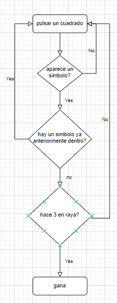
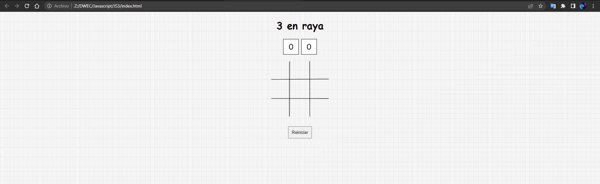
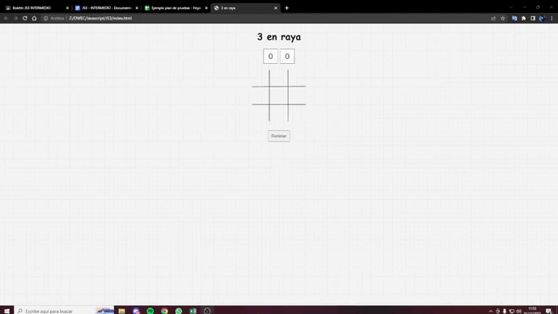
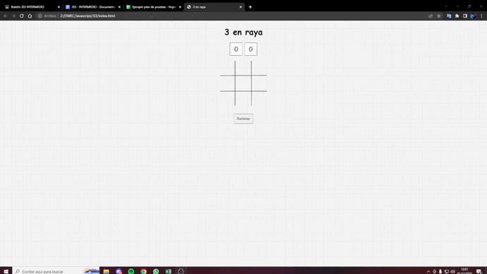

# JS2

## 1. ANALISIS DEL PROBLEMA   
1. Realizar el juego del tres en raya en el navegador mediante Javascript, apoyándose de la documentación suministrada.     Las reglas del juego serán las siguientes:
  - Cada jugador solo debe colocar su símbolo una vez por turno.
  - No se puede seleccionar la misma casilla más de una vez.
  - Se debe conseguir realizar una línea recta o diagonal por símbolo.

2.El ganador de la partida sumará un punto a su contador y aparecerá un aviso de si se quiere volver a jugar.

## 2.DISEÑO

## 3.IMPLEMENTACION
Implemento todo lo visto anteriormente para realizar el problema

## 4.PRUEBAS

## Prueba 1

## Prueba 2

## Prueba 3

## Prueba 4

## Prueba 5
