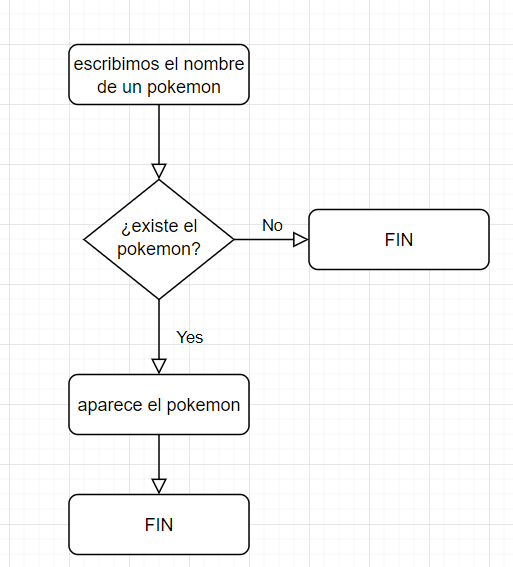
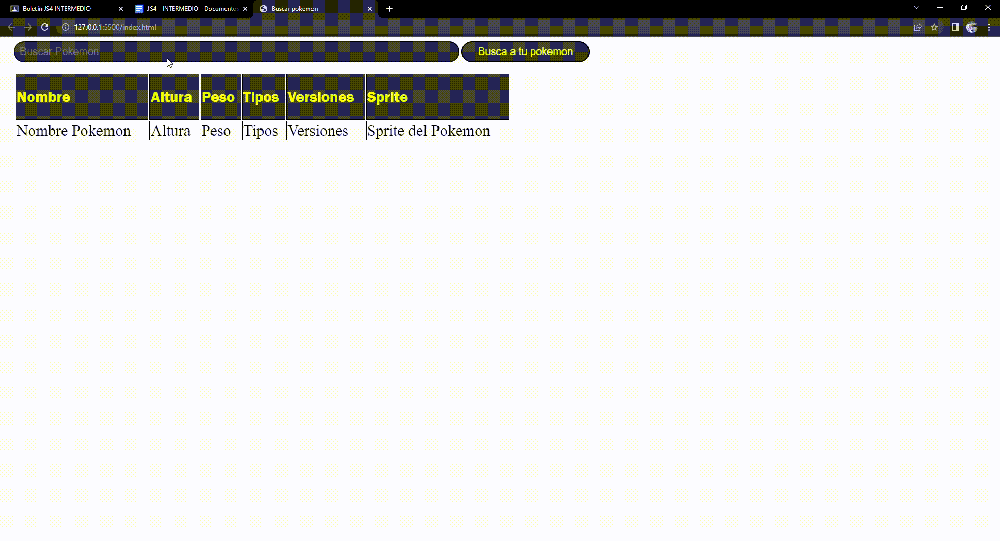
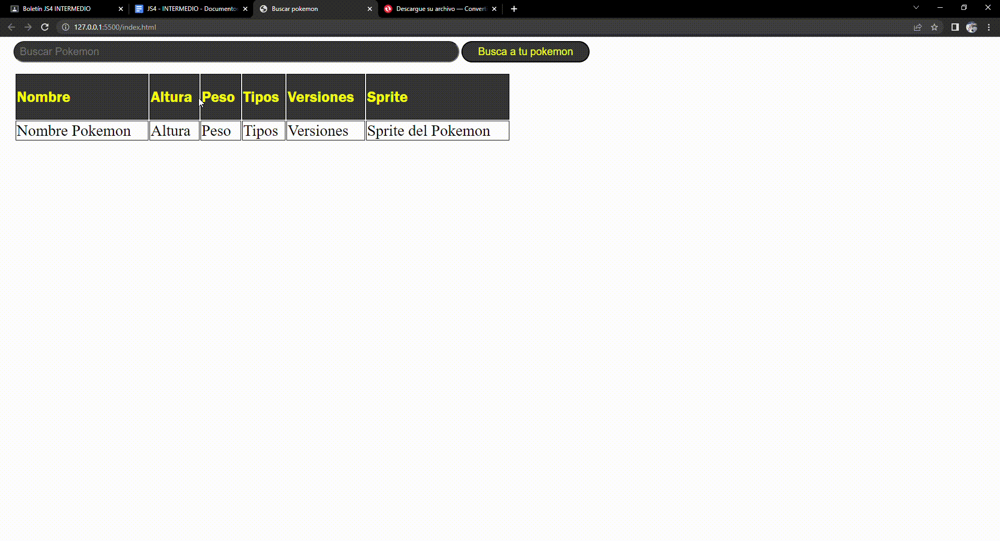

# JS2

## 1. ANALISIS DEL PROBLEMA   
1. Hay que analizar la pokeapi y sacar los siguientes datos:
Un campo de texto editable donde al introducir el nombre de un pokemon (sin tener en cuenta si es en mayúsculas o minúsculas), se obtendrá la información del Pokémon que se indica a continuación.
2. Sprite del Pokémon buscado.
3. Nombre del Pokémon buscado.
4. Altura del Pokémon buscado.
5. Peso del Pokémon buscado.
6. Listado del nombre de las versiones en las que aparece el Pokémon buscado.
7. Tipo/s del Pokémon buscado.

## 2.DISEÑO

## 3.IMPLEMENTACION
Implemento todo lo visto anteriormente para realizar el problema

## 4.PRUEBAS

## Prueba 1 (pokemon inexistente)

## Prueba 2 (pokemon existente)
