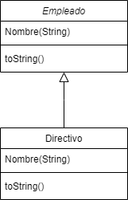
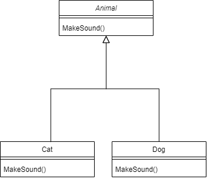
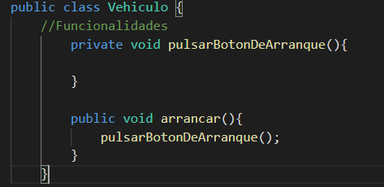
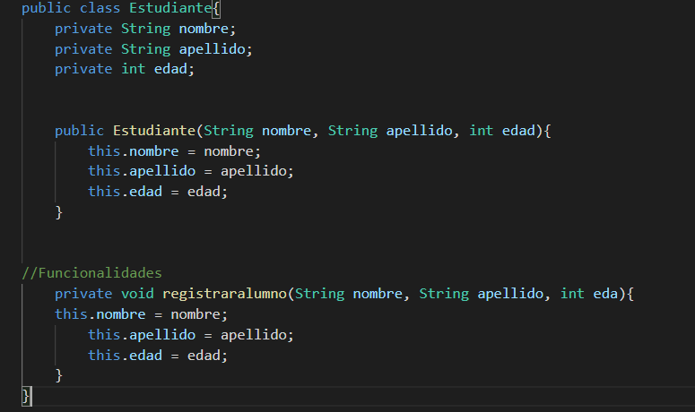
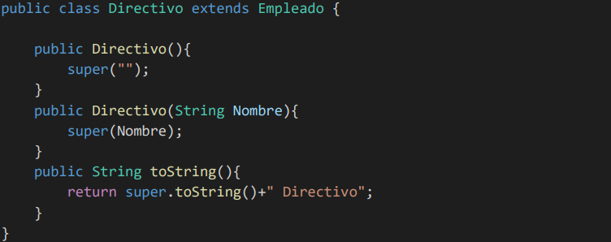
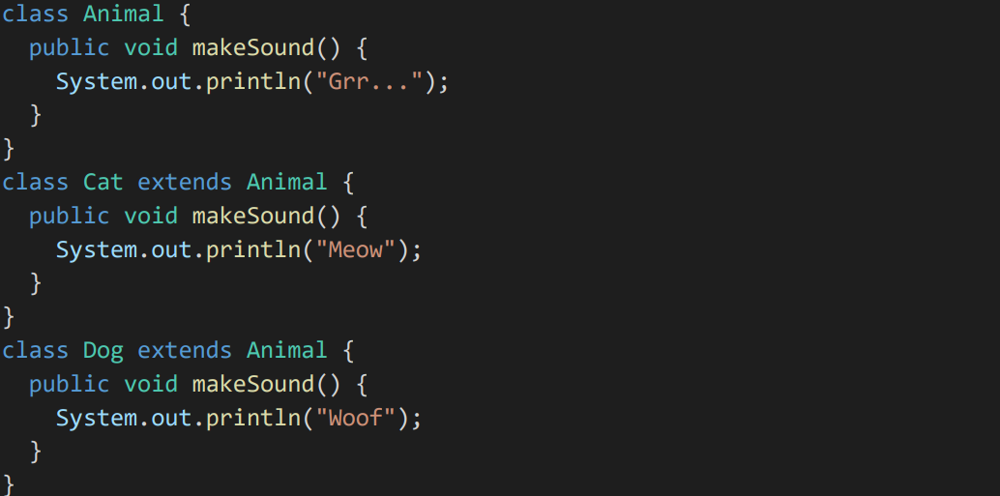
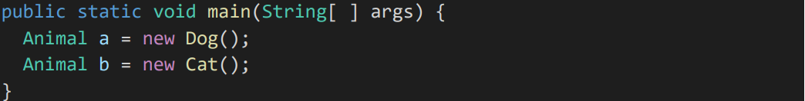

## Programación Orientada a Objetos

> Tarea AVANZADA.

### 🔍 Análisis del problema

#### ENCAPSULACION:
El término encapsulamiento en Java, consiste  en ocultar atributos de un objeto de manera que solo se pueda cambiar mediante operaciones definidas en ese objeto.  

#### ABSTRACCION:
La abstracción consiste en seleccionar datos de un conjunto más grande para mostrar solo los detalles relevantes del objeto

#### HERENCIA:
Es el mecanismo por el cual una clase permite heredar las características (atributos y métodos) de otra clase.

#### POLIMORFISMO:
En programación orientada a objetos, polimorfismo es la capacidad que tienen los objetos de una clase en ofrecer respuesta distinta e independiente en función de los parámetros (diferentes implementaciones) utilizados durante su invocación.

#### 🤔 ¿Qué son?

**Clases**

`Define de forma genérica cómo van a ser los objetos de un tipo`

**Objetos**

`Es la definición de una clase. Global y genérica`

**Instancias**

`Creadas a partir de una clase, son capaces de modificar métodos y atributos de forma independiente`

---

### 📐 Diseño de la solución

Para realizar este apartado de Tarea INTERMEDIO, he creado un fichero de texto para realizar el apartado de _Pseudocodigo_, una carpeta para _Java_ y otra para _Python_.

**UML de ejemplo para la solución**

### 💡 Pruebas
####  ABSTRACCION

####  HERENCIA

####  POLIMORFISMO

Como todos los objetos Gato y Perro son objetos Animales, podemos hacer lo siguiente

Creamos dos variables de referencia de tipo Animal y las apuntamos a los objetos Gato y Perro. 
Ahora, podemos llamar a los métodos makeSound().

